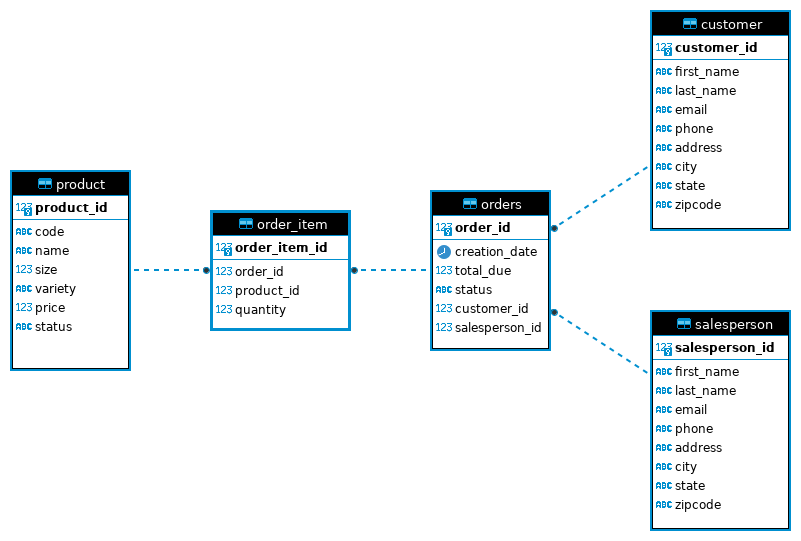

# Introduction

This JDBC app connects to a PSQL database and allows the user to perform CRUD operations to the database from Java.
The app connects to a sales database containing order, product, customer, and sales representative data for a retail store.
Create, read, update, and delete operations are available for the customer table as well as read operations for the order and order item tables.
This app uses Maven for build management.

# Implementaiton
## ER Diagram

## Design Patterns
Discuss DAO and Repository design patterns (150-200 words)

# Test
This app was tested with sample data inserted into the database and verifying query results on PSQL.